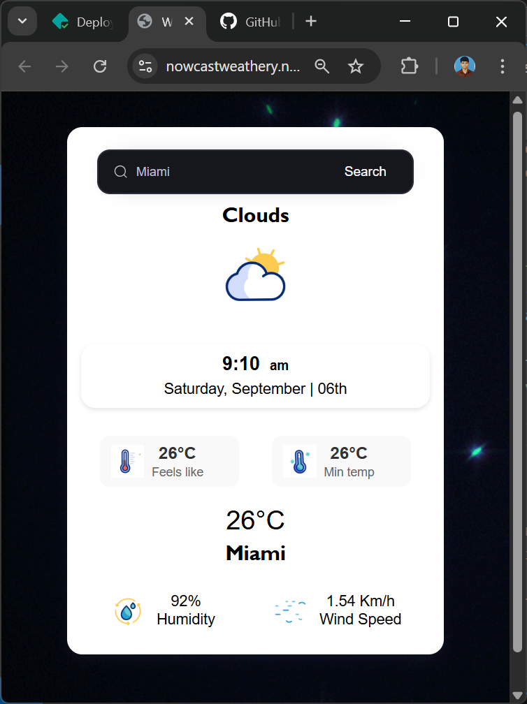
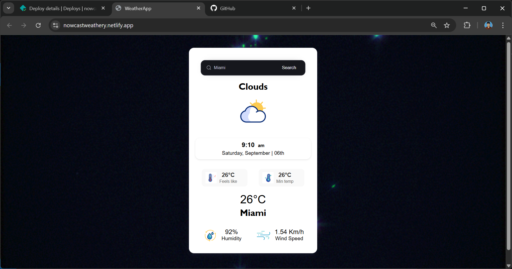

# 🌦️ Nowcast Weather App

A modern weather forecasting web application that provides **real-time weather data** and **local time** for any city in the world.  
Built with **HTML, CSS, JavaScript, jQuery, OpenWeather API**, and deployed on **Netlify** using **serverless functions**.


---

## 🌍 Live Demo

🔗 [Nowcast Weather App](https://nowcastweathery.netlify.app/)

---


## 📸 Screenshots

### 📱 Mobile View


### 🌤️ Desktop View



---

## ✨ Features

- 🔍 **Search any city** and get instant weather updates  
- 🌡️ **Temperature, Humidity, Wind Speed, Min/Max Feels Like**  
- ⏰ **Accurate Local Time** (calculated via OpenWeather timezone offset)  
- 🌄 Dynamic **Weather Icons with GIF animations**  
- 📱 Fully **responsive design** for desktop,tablet and mobile devices even support old devices
- ⚡ **Serverless Functions (Netlify)** for secure API key handling  

---

## 📂 Project Structure

```
Nowcast/
│── netlify/
│   └── functions/
│       ├── weather.js     # Fetches weather from OpenWeather API
│       └── time.js        # Handles local time calculation
│
│── src/
│   ├── Assets/Giff/       # Weather GIF animations
│   ├── index.html         # Main HTML page
│   ├── index.js           # Client-side logic (fetch & UI updates)
│   ├── styles.css         # App styling
│   └── jquery-3.7.1.min.js# jQuery library
│
│── .gitignore
│── netlify.toml           # Netlify config
│── package.json           # NPM dependencies
│── README.md              # Documentation (this file)


```


## 🛠️ Tech Stack

- **Frontend:**
  - HTML5  
  - CSS3  
  - JavaScript (ES6+)  
  - jQuery  

- **Backend / Serverless:**
  - Netlify Functions (`weather.js`, `time.js`)  
  - Node.js  

- **APIs:**
  - [OpenWeatherMap API](https://openweathermap.org/api) – Weather Data  
  - [TimeAPI.io](https://timeapi.io) / [API Ninjas](https://api-ninjas.com/api/worldtime) – Time Data  

- **Tools & Deployment:**
  - Netlify (Hosting + Serverless Functions)  
  - Git & GitHub (Version Control)  
  - VS Code (Development)  


---

## 🤝 Contributing

Contributions, issues, and feature requests are welcome!  
Feel free to **fork this repo** and submit a pull request.

---

## 📜 License

This project is licensed under the **MIT License** – you’re free to use, modify, and distribute it.

---

## 👨‍💻 Author

**Mukesh Gurusamy**  
GitHub: [@mukeshgurusamy-dev](https://github.com/mukeshgurusamy-dev)


---

## ⭐ Support

If you like this project, don’t forget to **star this repository** ⭐  
It helps others discover the project and keeps me motivated to improve it!


